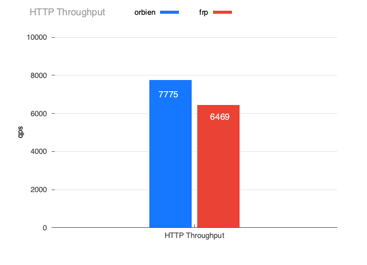

# 性能测试

| 环境 | 说明                                                     |
|----|--------------------------------------------------------|
| 平台 | macOS 26.2· Darwin 25.2.0 · arm64               |
| 硬件 | Apple M2（8 核）· 16 GB                                   |
| 详细 | [benchmarks](https://github.com/orbien-org/benchmarks) |

为了排除各种干扰因素，本测试是在本地回环下进行，相较于`frp`，`Orbien`比较明显的优势是在高并发条件下内存占用更低、更加平稳。

